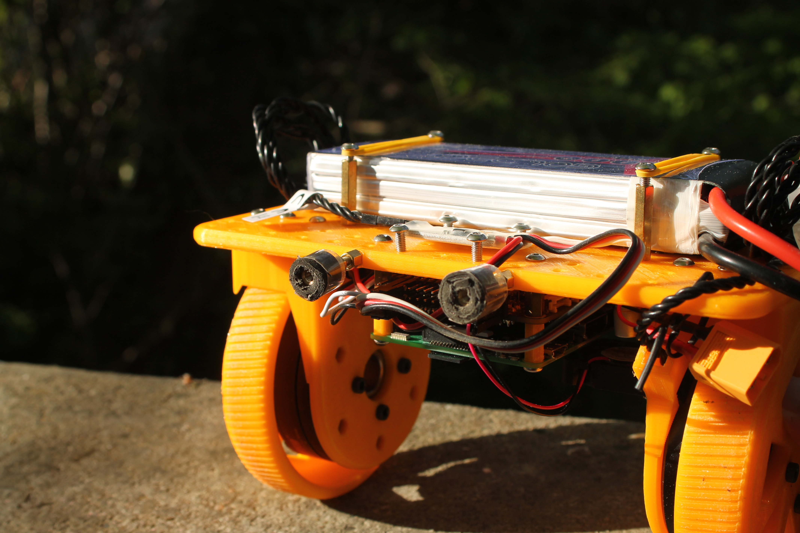

# Balancing Robot Version 1.0

These are the CAD files, which are necessary to print your own balancing robot. Feel free to take a look at the [robot assembly file](stl/RobotAssembly.stl) in this repository!

## Things to check before printing

* Consider where to put your 
  * motor controllers,
  * power converters and
  * battery
* The not-in-line holes on the `BasePlate` are matching to a Raspberry Pi 3b
* Also think about cable management

## Parts to print

* 1x BasePlate
* 2x WheelMount
* 2x WheelAttachment
* 2x MountedGear
* 2x InnerRim
* 2x OuterRim
* 4x InnerRoller
* 1x LidarMountPlate

## Parts used in my build

* Raspberry Pi 3b
* Navio2 Board
* 2x BGMC from RoverTEC
* 2x BGM5208-200 brushless gimbal motors
* 3x Step-Down-Converter (to not overheat brushless gimbal motor controllers & brushless gimbal motors) 

## Known issues

* BGMC from RoverTEC seems to be to weak to work well -> Next version uses `ODrive Motor Controller`
* Due to current design USB device plugs might damage the rapsberry pi -> add some protection
* Due to current design PWM device plugs might damage the navio2 board -> add some protection

*If you want to have more details please open an issue in this repository*
